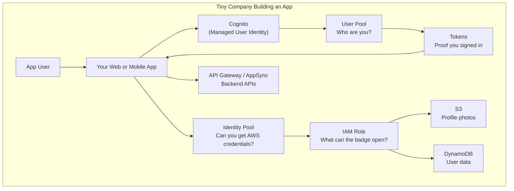

# Cognito = The Tiny Company’s Guest List

### Your App Was Not Supposed to Become a Login Factory

A tiny software company has a beautiful idea.

Not a small idea.

A real one.

A useful app. A sharp app. The kind of app that makes customers say, “Finally, someone built this properly.”

The dev team is small.
Maybe three engineers.
Maybe five.
Maybe one very caffeinated backend developer and a frontend developer who has already seen too much.

They gather around the roadmap.
The product is clear.

Users need to create accounts.
Users need to save preferences.
Users need to upload files.
Users need to see their own data.
Users need to come back tomorrow and still be themselves.

Simple.

Until someone says the sentence that ruins the sprint.

“How are users going to sign up and log in?”

At first, everyone stays calm.

Email and password.
How hard can that be?

Then the list begins.

- Sign up
- Sign in
- Password reset
- Email verification
- Phone verification
- MFA
- Social login
- Token expiration
- Refresh tokens
- Account recovery
- Suspicious login behavior
- Hosted login screens
- User groups
- App client configuration
- Secure password storage
- Session handling
- Logout
- Forgotten passwords
- Users who swear the app hates them personally

The roadmap starts sweating.

Because the tiny company did not set out to build identity infrastructure.

**It wanted to build the app.**

And yet, without user management, the app has no front door.

Without login, every user is a stranger every time.

Without proper authentication, the whole product becomes a house party where anyone can wander into the accounting drawer.

The company needs a guest list.

But it does not want to become a guest-list company.

That is where Amazon Cognito enters.

---

## Meet Cognito

Cognito does not build your product.
Cognito does not decide your business logic.
Cognito does not know whether your app is for banking, fitness, plant tracking, cruise ships, homework, trading, or emotionally suspicious todo lists.

Cognito has one job:

> Let the right app users in, and help your app know who they are.

It handles the identity work that tiny teams should not casually reinvent while pretending it is “just login.”

That is Amazon Cognito.

---

> Build the app. Do not accidentally become a password-reset company.

---

## Every User Needs a Door

An app user is not an AWS engineer.
An app user is not an EC2 instance.
An app user is not a Lambda function.

An app user is a human trying to use your product.

They want to sign up.
They want to sign in.

They want to reset a password when they forget it.
They want MFA when security matters.
They want to use Google, Apple, Facebook, or another identity provider when they do not feel like creating one more password destined for the graveyard.

Cognito is built for those application users.

Not your internal cloud administrators.
Not your deployment pipeline.
Not your backend service role.

Your customers.
Your app humans.

That distinction matters because AWS has many identity tools, and the exam loves putting them in the same room wearing similar jackets.

Cognito is about app-user identity.

IAM is about AWS permissions.

They can work together, but they are not the same thing.

---

## User Pools

### The Guest List

A User Pool is the guest list for your application.

It answers the question:

> Who are you?

Are you registered?
Did you enter the correct password?
Did you verify your email?
Did you pass MFA?
Did you sign in through Google, Apple, Facebook, SAML, or another identity provider?

Once the user signs in successfully, Cognito gives the app tokens.

Those tokens are not decorative stickers.
They are proof.
They tell the app:
“This user authenticated successfully.”

That is why User Pools belong in the authentication bucket.

Authentication means proving identity.

User Pool says:

> You are on the guest list.

In AWS terms, Cognito user pools authenticate users, while identity pools are used when users need temporary AWS credentials for service access.

---

## Tokens

### The Wristband at the Door

At a concert, the bouncer does not follow every guest around yelling, “Yes, this one paid!”

The guest gets a wristband.

Now the staff can look once and know:

This person entered properly.

Cognito tokens work like that.

After sign-in, the app receives tokens from the User Pool.

The app can use them to understand who the user is and whether the user has an active authenticated session.

The important part:

A token proves sign-in.

It does not magically grant unlimited AWS access.

That is the trap.

A wristband gets you into the venue.

It does not let you operate the lighting rig, open the safe, or drive the tour bus.

---

## Identity Pools

### The Temporary Staff Badge

Sometimes your app user needs to touch AWS resources directly.

Maybe they need to upload a profile picture to S3.
Maybe they need access to a specific protected asset.
Maybe a mobile app needs temporary credentials so it can call an AWS service safely.

You do not give the user long-term AWS keys.

That would be architectural clown shoes.

Instead, Identity Pools can exchange a trusted identity for temporary, limited-privilege AWS credentials.

User Pool:
> Who are you?

Identity Pool:
> Now that we know who you are, can you receive a temporary AWS badge?

AWS documentation describes identity pools as issuing temporary AWS credentials for authenticated or anonymous users, with permissions controlled through IAM roles and policies.

---

## IAM Roles

### What the Badge Actually Opens

The temporary badge still needs rules.

A badge without rules is just a laminated security incident.

That is where IAM comes in.

IAM defines what the temporary credentials are allowed to do.

For example:

- Upload only to `s3://my-app-users/${userId}/profile-photo.jpg`
- Read only the user’s own protected assets
- Call only specific AWS APIs
- Use different access based on user group or attributes

Identity Pool gives the user temporary AWS credentials.

IAM decides what those credentials can actually access.

This is the clean separation:

User Pool proves the human.

Identity Pool issues temporary AWS credentials.

IAM controls the permissions.

When you connect a User Pool to an Identity Pool, the app can exchange User Pool tokens for temporary AWS credentials that are scoped by IAM roles and policies.

---

## Managed Login and Hosted UI

### The Login Desk You Did Not Have to Build

A tiny team can build its own login screens.
It can also build its own chair.
That does not mean it should.

Cognito managed login, including the classic hosted UI, gives you managed sign-up and sign-in pages.

Not always the prettiest ballroom in the kingdom.
But functional.
Useful.
Exam-relevant.

It lets the app redirect users to a managed login experience instead of building every login surface from scratch.

This matters because authentication is not just a form.

It is flows.
Redirects.
Callbacks.
Tokens.
Federation.
Security settings.
Logout behavior.

Hosted UI says:

> Here is the front desk. Customize what you must. Do not hand-carve the whole building unless you enjoy splinters.

---

## Social Login and Federation

### Let the Guest Arrive With Another Invitation

Some users do not want another password.

They already have Google.
They already have Apple.
They already have Facebook.

Some companies already have SAML or OIDC identity providers.

Cognito can integrate with external identity providers so users can sign in through existing accounts.

In story terms:

The guest does not always need a brand-new invitation printed by your company.
Sometimes they arrive with a trusted invitation from another house.

Cognito checks whether that invitation is acceptable.

If yes, the user enters.

This is federation.

The important memory hook:

Cognito can let users authenticate through outside identity providers, but your app still receives a usable identity flow through Cognito.

---

## Groups

### Different Guests, Different Rooms

Not every signed-in user gets the same app experience.

An admin sees more.
A regular user sees less.
A premium user sees paid features.
A support user may need access to tools customers never see.

Cognito User Pool groups can help organize users.

Groups are not the whole authorization universe, but they give your app a clean way to classify users.

The story version:

Everyone may be on the guest list.
But not everyone is invited into the wine cellar.

---

## She Welcomes. She Does Not Govern the Kingdom.

Cognito welcomes app users.

It helps your app know who they are.
It can help exchange that identity for temporary AWS credentials when needed.

But Cognito is not your entire security model.

It does not replace IAM.
It does not replace fine-grained application authorization.
It does not decide every business rule inside your app.
If your app says only account owners can view billing history, your app still needs to enforce that properly.

Cognito can tell you:
“This is Suma.”

Your app must still decide:
“What is Suma allowed to do inside this product?”

That is the line.

Cognito manages identity.

Your app still owns behavior.

---

## Painkiller

> **Problem:** A tiny dev team wants users to sign up, sign in, reset passwords, use MFA, and maybe log in with Google or Apple.
> **Pain:** Building secure user identity from scratch turns the roadmap into a swamp.
> **AWS solution:** Use Cognito. User Pools manage app-user authentication. Identity Pools can exchange trusted identities for temporary AWS credentials. IAM decides what those credentials can access.

---

## Why AWS Built Cognito

Without Cognito...

Every small app team becomes an identity team.
They build password reset.
They store credentials.
They wire MFA.
They handle social login.
They debug token expiration.
They manage account recovery.
They accidentally create security problems while trying to ship product features.

That is not the best use of a tiny team.

AWS built Cognito so application teams could add user identity without building the whole identity machine themselves.

The point is not glamour.
The point is relief.

Your users need a front door.
Your developers need their roadmap back.

That is Amazon Cognito.

---

## The Masthead

### What Actually Just Happened

Strip away the tiny company, and here is the identity system you were really looking at:

|In the story|In Cognito|What it actually does|
|---|---|---|
|Tiny company|Your app team|The builders who need user identity without creating it from scratch|
|App user|End user|The human using your web or mobile application|
|Guest list|User Pool|User directory for sign-up, sign-in, MFA, password reset, and tokens|
|Wristband|Tokens|Proof that the user authenticated successfully|
|Temporary staff badge|Identity Pool credentials|Temporary AWS credentials issued to authenticated or guest users|
|Security rules for the badge|IAM role and policy|Defines what AWS resources the temporary credentials can access|
|Login desk|Hosted UI|Managed sign-up and sign-in experience|
|Invitation from another house|Federation / social login|Sign-in through external identity providers like Google, Apple, Facebook, SAML, or OIDC|
|Different rooms|Groups|Organize users for different app experiences or role mapping|
|Build the app, not login plumbing|Cognito|Managed app-user identity for teams that do not want to reinvent authentication|

One tiny team kept building the product.

Cognito handled the guest list.

---

## A Note From the Author

The tiny-company story gets the main idea right, but here is where the metaphor stops.

First, Cognito is not only for tiny companies. Large companies use it too. The story uses a tiny team because the pain is easiest to feel there: nobody wants to spend precious roadmap time building password reset and token flows unless identity is the actual product.

Second, User Pools and Identity Pools are separate concepts. The story makes them feel like two desks in the same lobby, but in real architecture you choose and configure them intentionally. You can use a User Pool without an Identity Pool. You use an Identity Pool when users need temporary AWS credentials.

Third, Cognito does not remove all authorization work from your app. It can authenticate users and help with groups, claims, and temporary AWS access, but your application still has to enforce business rules correctly.

Use the story to remember the door.

Use the note to remember the locks.

---

## The Last Bite

Cognito gives your application a managed front door.

Your application still decides what each authenticated user may do inside.

---

**Next chapter:** _Which Cape Are You Wearing? IAM as a Superhero Universe_

Cognito can prove who entered and help issue a temporary badge.

Next, we will explore how IAM decides which powers that identity or badge actually carries.
