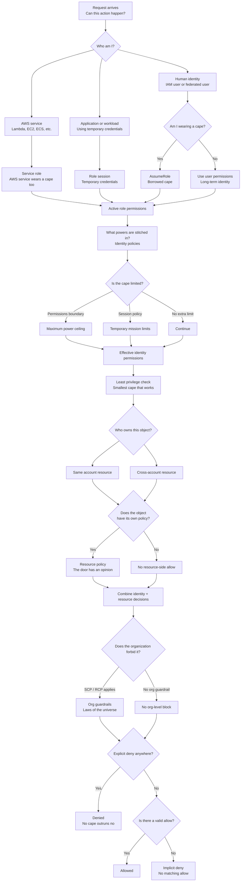

# Which Cape Are You Wearing? IAM as a Superhero Universe

### I Tried to Memorize IAM

Identity policies.
Resource policies.
Groups.
Roles.
Trust policies.
SCPs.
Permission boundaries.
Session policies.

It looked organized.
It did not feel organized.

Every diagram made sense for about thirty seconds.
Then an exam question would show up and ask:

> A user in Account A assumes a role in Account B to access a DynamoDB table with a resource policy, while an SCP applies at the organization level...

And my brain quietly walked into the ocean.
So I stopped trying to memorize the diagram.

I asked one ridiculous question instead.

What if AWS IAM was a superhero universe?

---

## The Person Is Not the Cape

This was the first crack in the wall.

A person is just a person.

The cape is what gives them powers.

The suit can fly.
The mask can open doors.
The badge can enter restricted rooms.
The borrowed armor can do things an ordinary shirt cannot.

That is IAM.

A human being is not automatically powerful in AWS.

A user is just an identity.

The permissions come from the cape.

Or the suit.

Or the role.

The question is not only:

> Who are you?

The better question is:

> Which cape are you wearing?

---

## The Cape Has Powers

### Identity Policy

Once I saw the cape, policies finally made sense.

A policy is not the hero.

A policy is the power stitched into the cape.

Can this cape read from S3?
Can it write to DynamoDB?
Can it invoke Lambda?
Can it publish to SNS?

That is an identity policy.

It attaches permissions to an IAM identity: a user, group, or role.

The cape does not care about confidence.

It does not care about job title.

It only cares what powers were stitched into it.

---

## The Hero Team

### IAM Group

Some heroes belong to a team.

The team has shared access.

Everyone on the team gets the team’s standard gear.

That is an IAM group.

A group is a way to manage permissions for multiple users.
Add a user to the group, and the user receives the group’s permissions.
Remove the user, and those permissions leave with the group.
The team is useful.

But the team itself does not go on missions.
People do.

---

## Borrowed Capes

### AssumeRole

Then came the real unlock.

An AssumeRole is a borrowed cape.
You do not permanently become someone else.
You assume the role.

For a while, you wear that cape.

A developer can assume a production-read-only role.
A Lambda function can assume an execution role.
An EC2 instance can assume an instance role.
A user in Account A can assume a role in Account B.

The role has permissions.
*The role also has rules for who may wear it.*

That second part matters.

Because not everyone gets to grab the legendary cape from the vault and call it a Tuesday.

---

## AWS Services Wear Capes Too

Humans are not the only ones who need permissions.

Lambda needs a cape when it writes to DynamoDB.
EC2 needs a cape when it reads from S3.
ECS tasks need capes when they publish to SNS.

AWS services do not get magical access just because they are AWS services.
They need roles too.

A Lambda execution role is the cape Lambda wears while your function runs.
An EC2 instance profile is how an EC2 instance gets a cape.

The service acts.
The role defines what it can do.
Even the robots need costumes.

---

## Who Is Allowed to Wear the Cape?

### Trust Policy

A role has two sides.

One side says:
- What can this cape do?
	- That is the **permissions** policy.

The other side says:

- Who is allowed to wear this cape?
	- That is the **trust** policy.

This is why cross-account IAM questions feel slippery.

Account B may have a powerful role.
But Account A cannot use it unless Account B’s trust policy allows that principal to assume it.

The cape can have powers.
The closet can still be locked.

---

## The Cape Has a Ceiling

### Permissions Boundary

Now imagine a superhero trainee.

The suit has powers.
But the mentor installs a limiter.
No matter what upgrades get added later, the trainee cannot exceed the safety ceiling.

That is a permissions boundary.
A permissions boundary does not grant permissions by itself.
It sets the maximum permissions an identity-based policy can grant.

This is the part that tricks people.
The cape still needs powers stitched into it.
The boundary only says how far those powers are allowed to go.

It is not the engine.
It is the ceiling.

---

## The Temporary Mission Brief

### Session Policy

Sometimes you wear a cape for one mission only.

Even then, someone hands you a temporary mission brief.

For this mission:

Read only.
This bucket only.
This hour only.
No extra heroics.

That is a **session** policy.

When you assume a role, session policies can further restrict what the temporary credentials can do.

They do not add new powers.
They narrow the mission.

The cape may be capable of more.
This mission is not.

---

## The Cape Is Temporary

### Temporary Credentials

When you assume a role, AWS does not hand you the permanent cape.

It gives you temporary credentials.

A temporary access key.
A temporary secret.
A session token.
An expiration time.

For that session, AWS sees you as the role.
When the session expires, the cape comes off.

That is why AssumeRole is safer than sharing permanent credentials.

The power is real.
But it is rented, not owned.

---

## The Door Has an Opinion

### Resource Policy

Then I realized something else.

The hero is not the only one making decisions.
The door has an opinion.

The S3 bucket can say:
> I allow this principal.

The KMS key can say:
> I trust this account.

The Lambda function can say:
> This service may invoke me.

That is a resource-based policy.

Identity policy asks:
> Does the cape allow the hero to act?

Resource policy asks:
> Does the object allow this hero in?

Inside one account, identity-based and resource-based allows generally form a union.

If the cape allows the action, or the door directly allows the principal, the request may proceed.

But that is the first-pass model, not the whole evaluation engine. Permissions boundaries, session policies, organization guardrails, service-specific rules, and explicit denies can still narrow or block the request.

Across accounts, direct resource access is stricter. The identity in the trusted account needs permission to make the request, and the resource policy in the trusting account must allow that external principal.

Same account often means either side can provide the allow.

Cross-account direct access requires permission on both sides.

---

## The Laws of the Universe

### SCP

Above the heroes, above the capes, above the doors, there are cosmic laws.

The organization can say:
> No one in this account may do this.

That is a Service Control Policy.

An SCP does not grant permissions.
It sets the outer boundary for what accounts in an AWS Organization are allowed to do.

Even if the cape says yes.
Even if the hero says yes.
Even if the door says yes.
The universe can still say no.

An SCP is a law governing the hero:

> No matter what cape you wear, you cannot fly in this dimension.

It limits the maximum permissions available to principals in member accounts.

### RCP

A Resource Control Policy is a law governing the place:

> No matter who knocks, this door cannot open under these conditions.

It limits the maximum permissions available against supported resources in member accounts, including requests made by external principals.

Neither an SCP nor an RCP grants access.

They are guardrails: principal-centric law and resource-centric law.

---

## The Hard No

### Explicit Deny

Then there is the simplest rule in IAM.

If anyone explicitly says no, it is no.
Not maybe.
Not “but I have another policy.”
Not “but I am wearing the fancy cape.”
Explicit deny wins.

**Every. Time.**

That is the hard no.
You can have identity permissions.
You can have resource permissions.
You can have the right role.
You can have the right account.

But if an applicable policy explicitly denies the action, the story ends there.
No cape outruns an explicit deny.

---

## The Cross-Account Scene

This is where the cape model really helped.

Suppose Account A has a developer.
Account B has a DynamoDB table.

The developer in Account A wants to write to the table in Account B.
That does not work just because the developer feels important.

Someone must allow the crossing.
Usually the cleaner pattern is:

Account B creates a role.
That role has permissions to write to the DynamoDB table.
The role’s trust policy allows the Account A principal to assume it.

The developer from Account A assumes the role.
Now the developer is wearing Account B’s cape.

For that session, AWS evaluates the role’s permissions, any session limits, any resource policies, and any organization guardrails.

The important part:

**The developer did not magically bring all of Account A’s powers into Account B.**
**They borrowed a cape from Account B.**
**That cape decides what they can do there.**

### The Ultimate Test

AssumeRole does not eliminate cross-account authorization.

It moves the cross-account decision to the moment the cape is borrowed.

First, AWS asks whether the developer may put on the cape:

1. Account A must allow the developer to call `sts:AssumeRole` for the role.
2. Account B’s role trust policy must trust that Account A principal.

Only when both sides agree does AWS issue temporary credentials for the role session.

```text
Account A developer
        |
        v
Authorized to call AssumeRole
        |
        v
Trusted by Account B role
        |
        v
Account B role session
        |
        v
Request to Account B table
```

Then AWS asks what the borrowed cape may do.

The original Account A permissions do not travel with the developer. The request uses the Account B role session, but the evaluation can still include the role policy, session policy, permissions boundary, resource policy, SCP, RCP, and any explicit deny.

The puzzle becomes easier to organize, but it does not become a policy-free single-account shortcut.

---

## The Smallest Cape That Works

### Least Privilege

A good cape should not do everything.

It should do the smallest useful thing.

Read this bucket.
Write to this table.
Invoke this function.
Only from this account.
Only for this path.

That is least privilege.

Not because AWS enjoys paperwork.
Because extra permissions become future incident fuel.
The safest cape is not the most powerful one.
It is the one that can do exactly the mission, and nothing more.

---

## The Cape Theory

When I see an IAM question now, I do not start with JSON.

I ask six questions.

1. Who am I?
2. Am I wearing a cape?
3. What powers does this cape have?
4. Who owns the object?
5. Does the object allow me?
6. Does the organization forbid it?


Then I ask the final override question:
> Did anyone explicitly say no?

If yes, denied.

If no, and every required layer allows it, allowed.
That is IAM.

Not one giant permission blob.
A stack of decision-makers.

If I answer those six questions, the IAM diagram almost draws itself.




---

## Painkiller

> **Problem:** AWS access decisions involve identities, roles, policies, resources, and organization-level guardrails.
> **Pain:** Memorizing IAM diagrams makes everything blur together, especially in cross-account and assumed-role scenarios.
> **AWS solution:** Think in layers. Identify the principal, the cape being worn, the powers attached to it, the limits around it, the resource’s own rules, and any explicit deny.

---

## Why AWS Built IAM This Way

Cloud systems are not one castle with one key.

They are many accounts.
Many teams.
Many services.
Many resources.
Many temporary identities.

A person may be a developer in one moment.
A deployment role in another.
A Lambda function in another.
A cross-account operator in another.

AWS needed a permission system that could answer a hard question precisely:
> Is this principal, wearing this identity, allowed to perform this action on this resource right now?

IAM is complicated because the real world is complicated.
The trick is not pretending it is simple.
The trick is knowing which layer is speaking.

---

## The Masthead

### What Actually Just Happened

|In the story|In AWS|What it actually means|
|---|---|---|
|The person behind the mask|IAM user|A long-term identity|
|The cape or suit|IAM role|A set of permissions that can be assumed|
|Powers stitched into the cape|Identity policy|Permissions attached to a user, group, or role|
|The hero team|IAM group|Permission management for multiple users|
|Borrowed cape|AssumeRole|Temporary credentials for a role|
|Who may wear the cape|Trust policy|Defines which principals can assume a role|
|Cape power ceiling|Permissions boundary|Maximum permissions an identity policy can grant|
|Temporary mission brief|Session policy|Restrictions on a role session|
|The door has an opinion|Resource policy|The resource grants or denies access|
|Law governing the hero|SCP|Principal-centric organization guardrail|
|Law governing the place|RCP|Resource-centric organization guardrail for supported resources|
|The hard no|Explicit deny|Final override that blocks access|

---

## A Note From the Author

The cape metaphor helps because IAM is not just about who you are.

It is about which identity is active right now.

A user can have permissions.
A group can contribute permissions.
A role can be assumed.
A session can be restricted.
A resource can allow or refuse access.
An organization can set outer limits.
And an explicit deny can end the whole story.

The best mental models do not simplify reality.
They reveal the hidden structure that was there, all along.

---

## The Last Bite

Access is never just about the hero.

It is about the identity, the active role, the policies, the resource, and every limit surrounding the request.

---

**Next chapter:** _STS = Polyjuice Potion_

IAM defines the cape, its powers, and who may wear it.

Next, we will explore how AWS STS lends that cape temporarily and issues the credentials that make the role session real.
