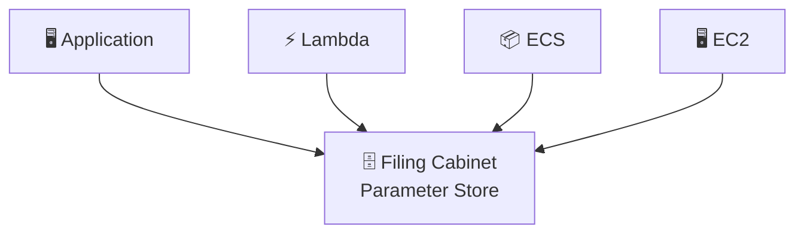

# Parameter Store = The Filing Cabinet

### Every Office Has One

Walk into any well-run office.

Against one wall sits an old filing cabinet.

Nothing about it looks impressive.

No flashing lights.
No security guards.
No vault doors.

Just neatly labeled drawers.

```
Database URL
API Endpoint
Redis Host
Feature Flag
Production Region
Email Sender
```

Every employee knows where it is.

Whenever someone needs information...

They open the drawer.
Read the paper.
Close the drawer.

Nobody asks who built the cabinet.
Nobody wonders where the paper came from.

They simply trust that the information is there.

Applications need exactly the same thing.

---

## Meet the Filing Cabinet

A filing cabinet doesn't make decisions.

It doesn't update itself.
It doesn't change the documents overnight.
It doesn't call anyone when the Wi-Fi password changes.
It simply stores organized information until someone asks for it.

**That is AWS Systems Manager Parameter Store.**

---



> **Everyone knows where the cabinet is. Nobody hardcodes the paper into their desk.**

---

## Every Drawer Has a Label

Imagine opening the cabinet.

The first drawer says:

```
/production
```

Inside that drawer are folders.

```
/production/database
/production/cache
/production/api
```

Inside **database** are more folders.

```
host
port
username
```

A filing cabinet isn't just storage.
It's organized storage.

Parameter Store works exactly the same way.

Hierarchies make thousands of parameters manageable.

---

## Some Drawers Have Locks

Not every document belongs in plain sight.

The payroll folder stays locked.
The HR cabinet stays locked.
The filing cabinet still holds them.
It simply locks those drawers.

Parameter Store calls this **SecureString**.

Instead of leaving sensitive values readable, Parameter Store encrypts them using AWS KMS.

The cabinet still stores the paper.

The lock simply protects it.

---

## Replacing the Paper

Suppose the database moves.

The old sheet says
```
db-old.company.com
```

Someone removes it.
Places in a new sheet.
```
db-new.company.com
```

The folder didn't change.
Only the paper inside.

Applications never cared where the information came from.
They simply open the drawer again.

Parameter Store creates a new version every time a parameter changes.

The name remains.

The value evolves.

---

## Reading the Whole Drawer

Imagine preparing a new office.

Instead of opening fifty folders individually...
You simply pull out the entire drawer.
Everything arrives together.

Parameter Store lets applications retrieve every parameter beneath a path.

```
/production/*
```

One request.

Many values.

The organization becomes the interface.

---

## Everyone Reads The Same Cabinet

Developers.
Lambda functions.
ECS containers.
EC2 instances.
CodeBuild.
CloudFormation.

They all visit the same cabinet.

Nobody copies configuration into source code.
Nobody emails configuration files.
Nobody wonders which version is correct.

Everyone reads from the same place.

---

## The Cabinet Doesn't Care

Notice something.

The filing cabinet doesn't know what the paper means.

```
Database URL
API Endpoint
Timeout
Theme Color
Feature Flag
```

They're all just folders.

Parameter Store doesn't care either.

It stores configuration.
It doesn't manage what the configuration represents.
That's someone else's job.

---

## Painkiller

> **Problem:** Applications need configuration that changes between environments without changing the code.
> **Pain:** Hardcoded values become impossible to update, organize, or share safely.
> **AWS Solution:** Store configuration in Parameter Store so every application reads the latest value from one organized location.

---

## Why AWS Built Parameter Store

Before Parameter Store...

Configuration lived everywhere.

Inside code.
Inside environment variables.
Inside wiki pages.
Inside README files.
Inside someone's memory.

Every deployment became a treasure hunt.

Parameter Store gave applications one reliable place to read configuration.

Not because storing strings is difficult.
Because organizing them consistently is.

---

## The Filing Cabinet Never Leaves Its Desk

The filing cabinet has one job.

Remember.

It doesn't rotate passwords.
It doesn't call database administrators.
It doesn't create new credentials.
It doesn't retire old ones.
It simply remembers where everything belongs.

That simplicity is exactly why it's useful.

---

## The Masthead

### What Actually Just Happened

| In the story                 | In Parameter Store  | What it actually means                                            |
| ---------------------------- | ------------------- | ----------------------------------------------------------------- |
| Filing cabinet               | Parameter Store     | Central configuration repository                                  |
| Drawer                       | Hierarchy (Path)    | Organize parameters logically                                     |
| Folder                       | Parameter Name      | Individual configuration item                                     |
| Paper                        | Parameter Value     | Stored configuration                                              |
| Locked drawer                | SecureString        | KMS-encrypted parameter                                           |
| Replacing paper              | New Version         | Parameter updates create versions                                 |
| Pulling out an entire drawer | GetParametersByPath | Retrieve many related parameters                                  |
| Office workers               | Applications        | Lambda, ECS, EC2, CloudFormation, CodeBuild reading configuration |

Everyone visited the same filing cabinet.

Nobody hardcoded configuration into the application.

---

## A Note From the Author

The filing cabinet deliberately simplifies a few things.

A real filing cabinet doesn't encrypt documents.
Parameter Store can, through AWS KMS.

A real filing cabinet doesn't remember previous versions forever.
Parameter Store keeps versions of parameters as they're updated.

Finally, Parameter Store can store SecureStrings.
That doesn't make it Secrets Manager.

The cabinet still stores information.
It doesn't actively manage the lifecycle of passwords, API keys, or credentials.

That's a different story.