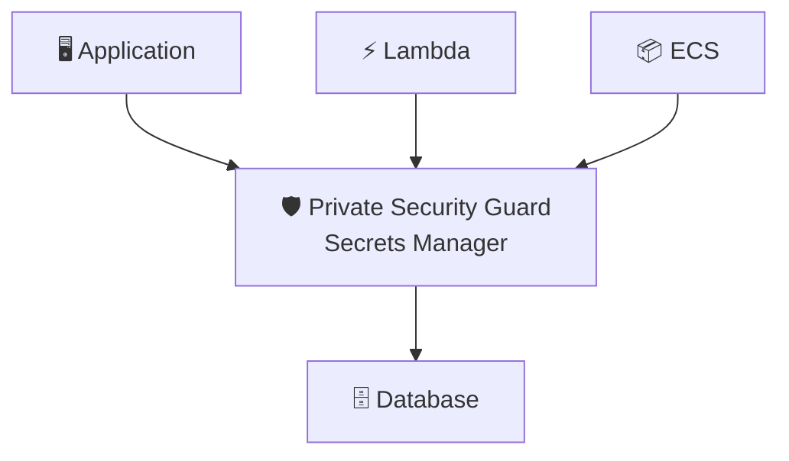

# Secrets Manager = The Private Security Guard

## The Key That Never Changed

The CEO moved into the company's headquarters twelve years ago.

On her first morning, the head of security handed her a brass key.

It opened the executive entrance.
It opened her office.
It opened the board room.
It opened the archive containing every confidential contract the company owned.

The key worked perfectly.

So nobody changed it.

Not after an assistant resigned.
Not after the cleaning company changed.
Not after contractors finished renovating the office.
Not after someone misplaced the key for two days and quietly found it again.

Everyone agreed the key should probably be replaced.
Nobody wanted to coordinate it.

Someone would have to replace every lock.
Someone would have to make new keys.
Someone would have to collect the old ones.
Someone would have to make sure nobody was locked out.

It was easier to keep using the old key.

Years passed.

The key never changed.

---

# Meet The Private Security Guard

The company hired a private security guard.

His job wasn't simply to keep the key safe.
His job was to manage it.

Every thirty days...

He installs a brand new lock.
Creates a new master key.

Quietly gives it to everyone still authorized.
Verifies the new key works.
Collects every old key.
Destroys them.

The CEO never schedules it.
The employees never remember it.

The guard simply keeps the building secure.

**That is AWS Secrets Manager.**

---

> **Applications don't remember passwords. They ask the guard for today's key.**

---

# Nobody Memorizes The Key

Engineers don't write the password into their code.

Containers don't keep copies forever.

Lambda doesn't carry yesterday's password.

Whenever access is needed...

They ask the guard.

The guard hands them today's key.

Nothing more.

---

# Changing The Locks

Imagine an employee leaves the company.

With a normal filing cabinet...

Someone eventually remembers to replace the key.

Maybe.

With the security guard...

The locks change automatically.

Old keys stop working.

New keys immediately replace them.

Nobody has to organize the transition.

Rotation isn't an emergency.

It's simply Tuesday.

---

# The Guard Knows Everyone

Not everyone receives the master key.

The guard checks the access list first.

Executives receive one key.

Finance receives another.

Cleaning staff receive none.

Secrets Manager does the same thing.

IAM decides who may retrieve a secret.

The guard never hands keys to strangers.

---

# The Building Never Notices

Notice something.

The CEO keeps working.

Employees keep entering.

Applications keep connecting.

The database never cares the password changed.

The guard quietly coordinated everything before anyone arrived for work.

Good security should feel boring.

---

# Painkiller

> **Problem:** Applications need passwords, API keys, and credentials.
> **Pain:** Humans rarely rotate them, leaving long-lived secrets exposed.
> **AWS Solution:** Store credentials in Secrets Manager so AWS securely stores, rotates, and distributes secrets automatically.

---

# Why AWS Built Secrets Manager

Parameter Store already stored encrypted values.

That wasn't the problem.

The problem was operational.

Passwords lived forever.

API keys spread through source code.

Nobody remembered to rotate credentials.

Secrets Manager wasn't built to store passwords.

It was built to manage them.

---

# The Guard Doesn't Store Documents

A filing cabinet stores information.

The security guard protects access.

That difference explains why AWS built two different services.

Parameter Store remembers.

Secrets Manager protects.

---

# The Masthead

## What Actually Just Happened

| In the story | In Secrets Manager | What it actually means |
|---|---|---|
| Private security guard | Secrets Manager | Managed secret lifecycle |
| Master key | Secret | Password, API key, token, credential |
| Access list | IAM | Authorization |
| Changing every lock | Automatic Rotation | Secret rotation |
| New master key | New Secret Version | Updated credential |
| Destroying old keys | Previous version retired | Old credentials invalidated |
| Employees asking the guard | GetSecretValue | Applications retrieve secrets |
| Building continues operating | Transparent rotation | Applications continue working with new credentials |

Applications never remembered the password.

They simply trusted the guard.

---

# A Note From The Author

The security guard simplifies a few things.

Real secret rotation often requires a Lambda function that updates the downstream system, such as a database password, before marking the new secret as current.

Secrets Manager doesn't decide who gets access.
IAM does.

Finally, Secrets Manager can store many kinds of secrets.
Passwords.
API keys.
OAuth tokens.
Certificates.

The story focuses on one master key because it illustrates the service's true purpose:

Managing the lifecycle of sensitive credentials, not merely storing them.