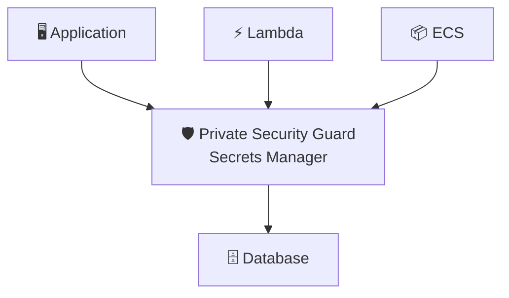

# Secrets Manager = The Private Security Guard

## The Key That Never Changed

The CEO moved into the company's headquarters twelve years ago.

On her first morning, the head of security handed her a brass key.

It opened the executive entrance.
It opened her office.
It opened the board room.
It opened the archive containing every confidential contract the company owned.

The key worked perfectly.

So nobody changed it.

Not after an assistant resigned.
Not after the cleaning company changed.
Not after contractors finished renovating the office.
Not after someone misplaced the key for two days and quietly found it again.

Everyone agreed the key should probably be replaced.
Nobody wanted to coordinate it.

Someone would have to replace every lock.
Someone would have to make new keys.
Someone would have to collect the old ones.
Someone would have to make sure nobody was locked out.

It was easier to keep using the old key.

Years passed.

The key never changed.

---

## Meet the Private Security Guard

The company hired a private security guard.

His job wasn't simply to keep the key safe.
His job was to manage it.

The company configures a thirty-day rotation schedule.

He installs a brand new lock.
Creates a new master key.

Updates the lock that accepts it.
Verifies the new key works.
Marks the new key as current.

The CEO does not coordinate each rotation by hand.
Employees do not carry a permanent copy.

The guard simply keeps the building secure.

**That is AWS Secrets Manager.**

---

> **Applications don't remember passwords. They ask the guard for today's key.**

---

## Nobody Memorizes the Key

Engineers don't write the password into their code.

Containers retrieve the secret at runtime and may cache it for a controlled period.

Lambda doesn't carry yesterday's password.

Whenever access is needed...

They ask the guard.

The guard returns the current secret to an authorized caller.

Nothing more.

---

## Changing the Locks

Imagine an employee leaves the company.

With a normal filing cabinet...

Someone eventually remembers to replace the key.

Maybe.

With the security guard...

When rotation is configured, the locks can change automatically.

Secrets Manager coordinates a pending version, the downstream system update, testing, and promotion of the new current version.

The previous version can be retained for recovery. Whether its credential still works depends on the rotation strategy and downstream system.

Managed integrations can handle this coordination. Other secret types use a Lambda rotation function that the customer must configure and operate.

Rotation isn't an emergency.

It's simply Tuesday.

---

## The Guard Checks the Access List

Not everyone receives the master key.

The guard checks the access list first.

Executives receive one key.
Finance receives another.
Cleaning staff receive none.

Secrets Manager does the same thing.

IAM is central to deciding who may retrieve a secret. A secret resource policy, KMS permissions, and a VPC endpoint policy can also affect the request.

The guard never hands keys to strangers.

---

## The Building Adopts the New Key

Notice something.

The CEO keeps working.
Employees keep entering.
Applications keep connecting.

The database or service must be updated to accept the rotated credential.

Applications must refresh cached values and retry safely when a credential changes.

When rotation and retrieval are configured correctly, the transition can happen without a manual credential rollout.

Good security should feel boring.

---

## Painkiller

> **Problem:** Applications need passwords, API keys, and credentials.
> **Pain:** Humans rarely rotate them, leaving long-lived secrets exposed.
> **AWS solution:** Store credentials in Secrets Manager, retrieve them at runtime, and configure managed or Lambda-based rotation for the downstream system.

---

## Knife Cut

Parameter Store remembers a value.

> **Secrets Manager manages a credential.**

---

## Why AWS Built Secrets Manager

Parameter Store already stored encrypted values.

That wasn't the problem.

The problem was operational.

Passwords lived forever.
API keys spread through source code.
Nobody remembered to rotate credentials.

Secrets Manager was not built merely to store passwords.

It was built to manage secrets throughout their lifecycle.

---

## The Guard Is Not the Filing Cabinet

A filing cabinet organizes information.

The security guard stores sensitive credentials and manages their controlled lifecycle.

That difference explains why AWS provides two related services.

Parameter Store organizes configuration, including encrypted values.

Secrets Manager stores encrypted secrets and adds lifecycle capabilities such as configured rotation.

---

## The Masthead

### What Actually Just Happened

| In the story | In Secrets Manager | What it actually means |
| --- | --- | --- |
| Private security guard | Secrets Manager | Managed secret lifecycle |
| Master key | Secret | Password, API key, token, or credential |
| Access list | IAM and resource policies | Authorization to retrieve the secret |
| Scheduled lock change | Configured rotation | Managed or Lambda-based secret rotation |
| New master key | New secret version | Updated credential begins as pending |
| Tested key becomes current | `AWSCURRENT` | Promoted version returned by default |
| Previous key retained | `AWSPREVIOUS` | Prior version retained; downstream validity varies |
| Employees asking the guard | `GetSecretValue` | Applications retrieve secrets at runtime |
| Building adopts the new key | Coordinated rotation | Downstream system and application retrieval must be configured correctly |

Applications did not hardcode the password.

They simply trusted the guard.

---

## A Note From the Author

The security guard simplifies a few things.

Real secret rotation often requires a Lambda function that updates the downstream system, such as a database password, before marking the new secret as current.

Lambda-based rotation moves through four steps: create a pending version, update the downstream system, test the pending credential, and finish by moving `AWSCURRENT`. Secrets Manager normally labels the prior version `AWSPREVIOUS`.

Some service-managed secrets support managed rotation without a customer-managed Lambda function.

Rotation is not enabled merely by storing a secret. Applications retrieve secrets and commonly cache them; Secrets Manager does not push every new value into running application memory.

IAM is central to deciding who gets access, but a secret resource policy, KMS permissions, and VPC endpoint policy can further shape the decision.

Finally, Secrets Manager can store many kinds of secrets.
Passwords.
API keys.
OAuth tokens.
Certificates.

The story focuses on one master key because it illustrates the service's true purpose:

Managing the lifecycle of sensitive credentials, not merely storing them.

---

## The Last Bite

Applications should not memorize long-lived credentials.

They should ask an authorized guard for the secret they need now.

---

**Next section:** _The Wand Chooses the Wizard_

Identity and security determine who may enter, which role they wear, and how sensitive values stay protected.

Next, we will move into compute and let each workload choose the worker that fits it.
