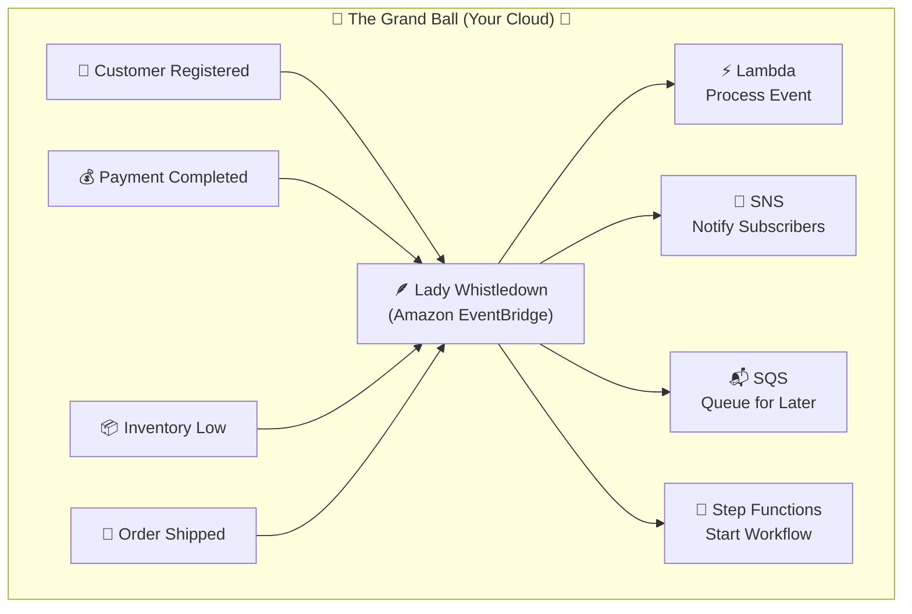

# EventBridge = Lady Whistledown

### A Ball is Never Just a Ball

Tonight, the Queen hosts the grandest ball of the season.

The finest gowns fill the ballroom. Music echoes through the palace. Champagne flows. Everyone appears to be dancing.

But the ball isn't really about dancing.

_**It's about information.**_

- Who arrived?
- Who danced with whom?
- Who was absent?
- Who received the Queen's attention?
- Who proposed?
- Who caused a scandal?

By sunrise, every corner of the kingdom wants a piece of the story.

- The nobles.
- The merchants.
- The printers.
- The Queen's Guard.

Even people who never attended the ball.

And yet...

No one runs from family to family repeating the news. No one maintains a list of every household that should be informed whenever something interesting happens.

The Duke doesn't know who cares that he proposed. The Queen doesn't notify every guard captain personally. The stable master doesn't send letters to every merchant when a carriage overturns.

Everyone simply whispers.

Somehow...

The right people always hear the right story.

But how?

***In polite society, reputation spreads faster than people.***
***In distributed systems, events spread faster than requests.***=

---

## Meet Lady Whistledown

Lady Whistledown doesn't create the news.

She doesn't stop the news. She doesn't tell everyone. She simply asks one question.

> **Who can do something with this information?**

Not who's curious. Not who'd enjoy hearing it. Who has a reason to _act_.

Then she quietly delivers each story to exactly the right audience — and lets everyone else keep dancing, undisturbed.

**That is Amazon EventBridge.**

---



> **Everyone has a role. No one has a mailing list.**

---

## Every Whisper is an Event

An event is nothing more than something that happened.

Good news. Bad news. Ordinary news. Scandalous news.

```
"The Queen has arrived."

"A carriage has overturned."

"The treasury received taxes."

"The Duke is engaged."

"The harvest is complete."
```

Notice something.

Nobody is asking for permission. Nobody is requesting work. They're simply announcing reality.

That's the first thing worth locking in: an event is a fact, not a command. The producer never tells anyone what to do with it.

---

## The Producers

Every person in the kingdom can generate news.

- The Queen issues decrees.
- Merchants announce shipments.
- Workers complete tasks.
- Noble families host balls.
- Guards report crimes.

Each simply whispers,

> "This happened."

Then returns to work.

They never wonder who heard it. They don't know, and they don't need to. That's the whole point — the producer and the eventual reactor have never met.

---

## The Event Bus

Lady Whistledown hears everything.

She isn't interested in the gossip itself. She's interested in routing information.

Every whisper passes through her. Every whisper is evaluated. Every whisper is delivered only where it belongs.

This is the piece that makes the rest possible: one central place every event flows through, so producers and subscribers never have to know about each other directly.

---

## Event Patterns

### Her Editorial Rules

Lady Whistledown never publishes everything to everyone.

She has standards.

If the Queen announces war...

Only the Guard, Treasury, and Generals need immediate notification.

If two nobles become engaged...

The Queen, Lady Danbury, and society pages receive the news.

Everyone else continues dancing.

Those editorial decisions are EventBridge **Rules**, and the criteria she checks each whisper against are **Event Patterns** — the "does this event match what I'm looking for" logic that decides who gets notified at all.

---

## Targets

### The Audience

Every family listens for different kinds of news.

The Queen's Guard responds to danger. The Royal Chronicle records history. The Bridgertons react to family matters. The Featheringtons react to opportunity.

One whisper. Many possible reactions. Or none at all.

Each of these is a **Target** — Lambda, SNS, SQS, Step Functions, another service entirely. A single rule can fan a whisper out to several targets at once. Nobody is forced to react, and nobody can react to news they were never told.

---

## Archive & Replay

### The Standing Order to Reprint

Every edition of Lady Whistledown's paper is preserved.

But this isn't just a dusty shelf of old newspapers. It's a **standing order**: if she reprints yesterday's edition, it doesn't quietly return to the same three households who read it the first time. It goes back out through her, past her _current_ editorial rules — and any family that started subscribing since then gets yesterday's scandal for the first time.

That matters more than it sounds. It means Archive & Replay isn't just "recover what we lost." It's how you handle:

- A family that just joined society and needs to be caught up on relevant history.
- A new editorial rule you wish had existed last month — replay the old whispers through the new rule and see who _should_ have been told.
- Reprocessing a season's worth of events after fixing a mistake in how a Target reacted to them.

The story stays the same. The audience doesn't have to.

---

## Schema Registry

### The Society Column's House Style

Good society follows etiquette. Announcements have structure — who, what, where, when.

But Lady Whistledown doesn't just enforce house style — she **learns** it. Watch her work the room for a season, and she starts noticing the shape every announcement takes without anyone dictating it to her: engagements always name the two families and the arranging matron; crimes always name the accused, the accuser, and the guard on duty.

That's the Schema Registry's real trick: EventBridge can **infer the schema directly from the events actually flowing through it**, and hand you **ready-made code bindings** — in whatever language your household clerks write in — so nobody has to hand-transcribe "here's the shape of a Duke's-engagement announcement" from scratch. The structure isn't just agreed upon by convention. It's discovered and then handed back to you as usable code.

---

## EventBridge Pipes

### The Courier Who Doesn't Work for the Newspaper

Here's where it's easy to get the wrong idea. Pipes can look like "a private version of the newspaper" — a whisper that skips the presses and goes straight to one recipient. It isn't quite that.

A Pipe doesn't start with a whisper arriving at Lady Whistledown's desk at all. It starts with a **standing courier posted at a source that never sends whispers on its own** — a ledger being updated line by line (DynamoDB Streams), a dispatch log filling up in real time (Kinesis), a locked mailbag waiting to be opened (SQS), a merchant's private message board (MSK/Kafka). These sources don't broadcast. Something has to go **pull** from them continuously.

That courier's job has a fixed shape, always in this order:

1. **Filter** — is this entry even worth carrying? Most aren't.
2. **Enrich** — add context the destination will need but the source didn't include.
3. **Deliver** — hand it to exactly one destination. Not the whole readership. One recipient.

So the real distinction isn't "public newspaper vs. private letter." It's this: **Rules react to whispers that are already flowing through the bus. Pipes go and fetch whispers from places that were never whispering to begin with**, then shape them before handing them off. Different job, different starting point, different destination count.

---

## She Reports. She Doesn't Command.

Notice something Lady Whistledown never once does across an entire season of gossip.

She never tells the Duke to propose again. She never orders the Guard to arrest anyone. She never instructs a single household how to respond to what she's printed.

She simply tells them what happened. What they do next is entirely their decision.

That's the whole philosophy of event-driven architecture, and it's worth holding up against the alternative directly:

**API Gateway:** _Do this._ **EventBridge:** _This happened._

A command has an obligation baked in — someone asked, someone must answer, and if nobody's there to answer, that's a failure. A fact has no such obligation. If nobody reacts to "the Duke proposed," nothing has gone wrong. The news was still true. It simply wasn't anyone's problem to solve.

That's why a target going quiet for an hour does not synchronously take down the ballroom. EventBridge retries failed delivery according to its retry policy; exhausted events should be captured with a dead-letter queue so they are not silently lost.

---

## Painkiller

> **Problem:** Applications need to announce that something happened.
> **Pain:** Direct connections between every producer and consumer become difficult to manage.
> **AWS solution:** Publish an event once and use EventBridge rules to route it to matching targets.

---

## Why AWS Built EventBridge

Without Lady Whistledown...

Every noble family would need to tell every other family whenever anything happened.

The ballroom would descend into chaos.

Instead, everyone simply whispers once. Lady Whistledown takes care of the rest.

That's loose coupling. That's event-driven architecture. That's Amazon EventBridge.

---

## The Masthead

### What Actually Just Happened

Strip away the ball, and here's the newsroom you were really looking at:

|In the story|In EventBridge|What it actually does|
|---|---|---|
|A whisper|**Event**|A fact that happened — a JSON payload, not a request|
|A noble, merchant, guard|**Producer**|Anything that emits an event, with zero knowledge of who's listening|
|Lady Whistledown|**Event Bus**|The central router every event passes through|
|Her editorial standards|**Rule**|The logic that decides which events go where|
|The criteria she checks|**Event Pattern**|The match condition inside a rule|
|The families who react|**Target**|Lambda, SNS, SQS, Step Functions — one rule can have several|
|The standing reprint order|**Archive & Replay**|Store past events; re-run them through _current_ rules on demand|
|Her learned house style|**Schema Registry**|Auto-discovers event structure from live traffic; generates code bindings|
|The standing courier|**Pipes**|Pull-based point-to-point pipeline: filter → enrich → one target|

Everyone whispered once. Lady Whistledown kept the kingdom synchronized.

---

## A Note From the Author

_Lady Whistledown was always the one narrator willing to step outside her own story and tell you the truth directly. So, in her tradition — three places where the ballroom simplifies something real:_

**Ordering isn't guaranteed.** The story tells events in sequence, one after another. EventBridge makes no promise that targets receive events in the order they occurred. If your system needs strict ordering, that's a design decision you make on top of EventBridge — not something the bus hands you for free.

**Delivery is at-least-once, not exactly-once.** The story implies one whisper reaches one household exactly one time. In reality, a target can receive the same event more than once. Targets need to be able to handle that without breaking — idempotency isn't optional, it's assumed.

**Targets can fail.** EventBridge retries target delivery, but retries eventually end. Production designs should configure retry behavior, monitoring, and a dead-letter queue where supported.

**Not every rule reacts to a whisper.** Everything in this story starts with something happening. But EventBridge also supports Scheduled Rules — rules that fire on a timer, whether or not any event occurred at all. There's no ballroom equivalent of "check the treasury every Sunday at noon, whisper or no whisper." That's a real gap in the metaphor, not a simplification of one — the story's premise is reactive, and this feature isn't.

_Use the story to build the intuition. Use this note to know exactly where the intuition stops._

---

## The Last Bite

Publish the fact once.

Let interested systems decide how to react without teaching the producer who they are.
